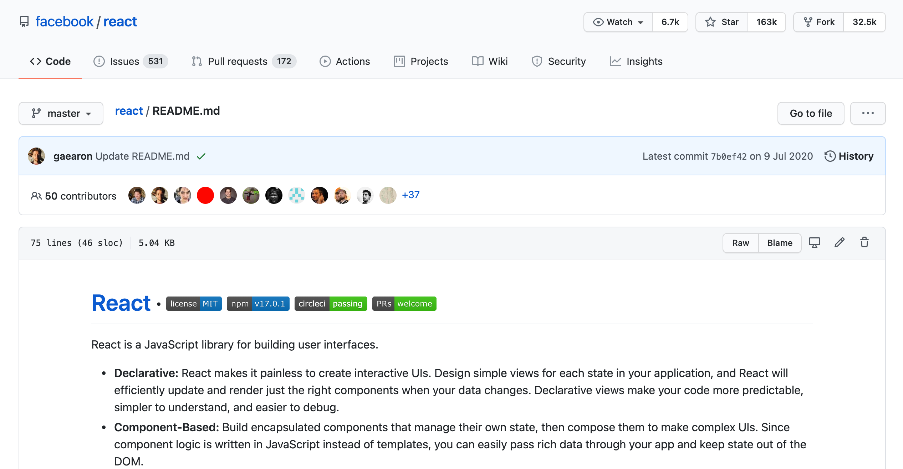
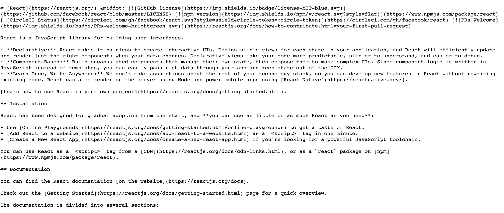

# Markdown 文档

> _Markdown_ 是一种轻量级文本标记语法，简单的文本编辑器即可编辑。与之对应的，超文本标记语言，如*html*，文本中可以包含图片、音乐、链接等非文字元素。最早由约翰·格鲁伯（John Gruber）于 2004 年创立。2017 年，GitHub 发布了基于 CommonMark 的 Github Flavored Markdown（[GFM](https://github.github.com/gfm/)）的正式规范。现代 Markdown 也逐渐支持了文本中插入图片、表格等元素，是开源项目 README 文档最佳选择（reStructuredText 文本标记也比较流行）。
>
> https://en.wikipedia.org/wiki/Markdown

[toc]

## 1.特性

当我们提及*Markdown*，其实含两个步骤：1.书写以 xxx.md 结尾的文本文档（文本以及特定的标记符号）、2.将 xxx.md 文档渲染，才能看到最终效果。比如，我们在 Github 阅读任何一个以 Markdown 记录的项目文档，加粗、倾斜都是渲染后的效果，如下图



点击右侧`Raw`按钮，可以看到原始的 Markdown 文档内容（看起来有点乱？等会儿掌握了语言，其实很简单），如图



值得说明的是，以 Markdown 形式记录文档，借助[Pandoc](https://pandoc.org/)工具，可以到处各类文档，如 word、pdf、html。这也是 Markdown 流行的主要原因。

> If you need to convert files from one markup format into another, **pandoc is your swiss-army knife**（Pandoc 是文档转换的瑞士军刀）

## 2.语法

Markdown 基础语法很简单，参照以下 5 分钟内可以掌握。但需要提醒的是，不同的平台/工具能够支持的 Markdown 语法在细节上不尽相同，有一些能支持数学公式、有些就不可以。学习时候建议以链接 1 Github Flavored Markdown（[GFM](https://github.github.com/gfm/)）规范为准，以链接 2 中文说明来入门。

1. [GFM-GitHub Flavored Markdown](https://github.github.com/gfm/)
2. [Markdown 5 分钟快速入门！](https://juejin.cn/post/6844903971811753992)

如果不想看上面，这里简要介绍下基本语法

### 语法-块元素

#### 段落（Paragraph）

单纯回车键分割的文字不会形成段落，在渲染时候还会拼在在一起。需要打 2 个及以上的空行，才会真正形成段落

#### 标题（Header，#）

```markdown
# 以#加空格，后续文字会形成一级标题

## 表示二级标题

###### 表示六级标题（最高六级）。注意也有一种语法是在标题文字下面一行用”=“来标记标题，忽略。掌握一种方式就好
```

#### 块引用（Blockquotes，`>`）

块引用，多用在大段的引文，比如引用名人名言，诗词语句等，以`> `开头。块引用里面回车键即换行，

```markdown
> 春眠不觉晓，处处闻啼鸟。
> 夜来风雨声，花落知多少。
```

> 春眠不觉晓，处处闻啼鸟。
> 夜来风雨声，花落知多少。

#### 列表（Lists）

- 有序列表，用`1. ` ，有序列表第二条记录仍可以以 `1. ` ，并不需要以`2. `，渲染后会自动替换成 2.
- 无序列表，用`* `或者`+ `或者`- `，渲染后效果都是如左侧大黑点

```markdown
###### 有序列表

1. Red
2. Green
3. Blue

###### 无序列表

- Red
- Green
- Blue

###### 嵌套列表，tab 缩紧即可

- Red
  - Light Red
  - Dark Red
```

###### 有序列表

Red

Green

Blue

###### 无序列表

- Red
- Green
- Blue

###### 嵌套列表，tab 缩紧即可

- Red
  - Light Red
  - Dark Red

#### 代码块（Code Blocks）

以一组反引号 ```包起来的地方都是代码块，能够对区域内代码进行高亮显示，可指定语言，注意没有空格。

```markdown
​`python import numpy as np print(np.pi) ​`

行内代码`console.log()`
```

```python
import numpy as np
print(np.pi)
```

行内代码`console.log()`

#### 数据公式（Math Blocks）

前提需要渲染 Markdown 的平台/工具支持**MathJax**：单组`$`表示行内公式；双`$$`表示行间公式

```markdown
这是行内公式：$\Theta$

这是行间公式

$$
\mathbf{V}_1 \times \mathbf{V}_2 =  \begin{vmatrix}
\mathbf{i} & \mathbf{j} & \mathbf{k} \\
\frac{\partial X}{\partial u} &  \frac{\partial Y}{\partial u} & 0 \\
\frac{\partial X}{\partial v} &  \frac{\partial Y}{\partial v} & 0 \\
\end{vmatrix}
$$
```

这是行内公式：$\Theta$

这是行间公式

$$
\mathbf{V}_1 \times \mathbf{V}_2 =  \begin{vmatrix}
\mathbf{i} & \mathbf{j} & \mathbf{k} \\
\frac{\partial X}{\partial u} &  \frac{\partial Y}{\partial u} & 0 \\
\frac{\partial X}{\partial v} &  \frac{\partial Y}{\partial v} & 0 \\
\end{vmatrix}
$$

#### 表格（Tables）

```markdown
| First Header | Second Header |
| -----------: | :------------ |
|    Row1 Coll | Row1 Col2     |
|    Row2 Coll | Row2 Col2     |
```

| First Header | Second Header |
| ------------ | ------------- |
| Row1 Coll    | Row1 Col2     |
| Row2 Coll    | Row2 Col2     |

#### 脚注（Footnotes）

正文中用`[^文本]`标记以及文末以`[^文本]：这是脚注内容文本`配对使用

```markdown
You can create footnotes like this[^footnote].

[^footnote]: Here is the _text_ of the **footnote**.
```

You can create footnotes like this[^footnote].

[^footnote]: Here is the _text_ of the **footnote**.

#### 分割线（Horizontal Rules）

在某行输入`***` or `---`渲染后成为一条横向的分割线

#### 目录（Table of Contents (TOC)）

使用`[toc]` 键入空格后，自动抓取多个层级的 header 形成目录

### 语法-标签元素

#### 超链接（links）

两种形态，行内超链接，即链接文本与 url 在一块，采用`[这是链接文本](http://example.com)`。另外一种是参考链接，仅在正文以`[]`框出链接文本，在文末统一添加链接，类似上述脚注用法。

```markdown
This is [an inline link](http://example.com/).
This is [an inline link with title](http://example.com/ "Title").

This is [an reference link][id].

[id](http://example.com/ "Title")
```

This is [an inline link](http://example.com/).
This is [an inline link with alt](http://example.com/ "Title").

This is [an reference link][id].

[id](http://example.com/ "Title")

#### 图片引用（Images）

可以采用以下（或者干脆使用 html 中 ``标签）

```markdown


```

#### 强调/加粗文字（Emphasis）

```markdown
_倾斜_
**加粗**
~~删除~~
```

_倾斜_
**加粗**
~~删除~~

#### 表情符号（Emoji）

```marks
`:smile:`
```

:smile:

#### 上标/下标

```markdown
8<sup>2</sup>=64
H<sub>2</sub>O
```

8<sup>2</sup>=64
H<sub>2</sub>O

#### 其他可引入 html 形式，如引入 mp4

```markdown
<video src="xxx.mp4" />
```

## 3.编辑器

- 任何文本编辑器都可以书写 Markdown 文档，如 Windows 下记事本。
- 任何 IDE 也可以编辑 Markdown 文档，配合相应的插件，还可以做到自动补全、语法高亮。如 VS Code、Atom、Sublime Text

## 4.渲染

- 上传到 Github 的 Markdown 文档会自然渲染出效果
- 通过 IDE 插件加持，也能所见即所得看到效果
- 通过[Pandoc](https://pandoc.org/)工具可以到处很多格式的文档，如 pdf/html/word/epub/mobi
